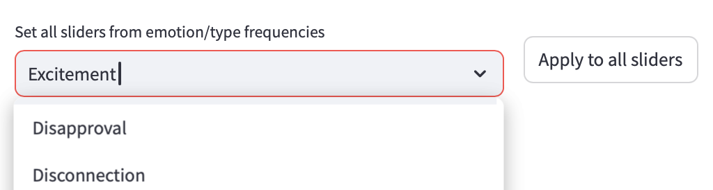
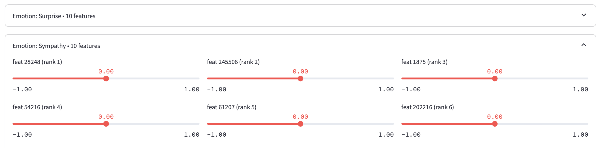
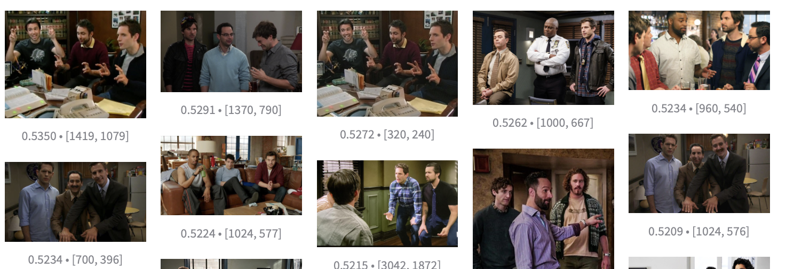
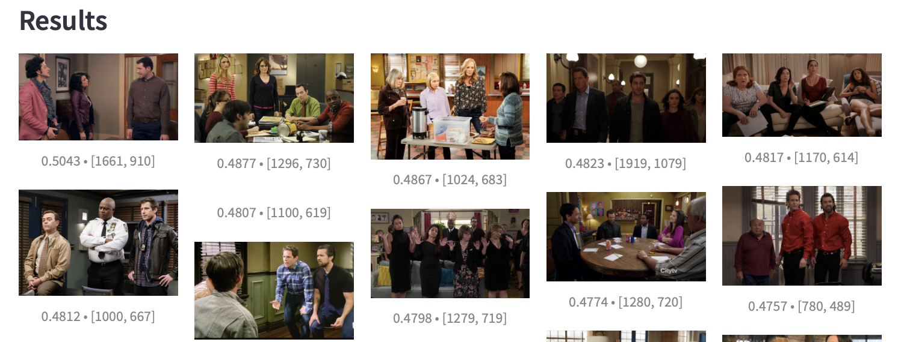

# SAEFE

Sparse Autoencoders for Emotion (SAEFE) is a method to adapt vision-language models for emotion recognition using interpretable features.

SAEFE can be used to attenuate bias by adding or removing features that are associated with gender, age, race, or other protected characteristics.

SAEFE is released with a configuration tool to assist in feature exploration. The configuration tool provides an image search interface which retrieves Reddit images that have the greatest cosine similarity to the selected features.

## Usage

First, a clip server with precomputed embeddings must be installed and running, such as [this one](https://github.com/osmarks/meme-search-engine/blob/master/clip_server.py).

The same SigLIP model must be used for compatibility with the trained sparse autoencoder.

Then, `ENDPOINT` in `app.py` must be set to the URL of the clip server. Run the app:

```bash
streamlit run app.py
```

### Use Case 1: Emotion Detection

The first use case is to search by label. Upon selecting e.g. "Excitement" and pressing "Apply to all sliders", each feature is set to the average activation associated with "Excitement". We can then search for images that are most similar to the label.



### Use Case 2: Individual Feature Selection

The second use-case is to search by individual feature. The top 10 features associated with each label is displayed and can be manually adjusted.

A negative value will maximize dissimilarity from the feature, a value of 0 is neutral to it, and a positive value will maximize similarity to the feature.



### Use Case 3: Bias Attenuation

Certain features may align with biases in the dataset. For example, feature 61207, which is most associated with "Esteem", encodes groups of men from TV shows and movies.

We can eliminate this bias in the Add/Subtract Label menu. There are pre-trained labels for gender and age. Using this menu, we can perform the following operation in semantic space:

$
Esteem_{Debiased}= Esteem_{Original} - Male + Adult
$

#### Before Operation



#### After Operation



